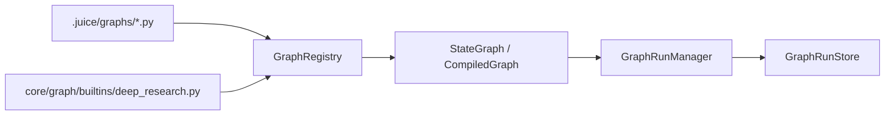
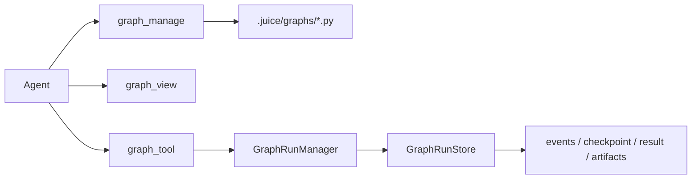
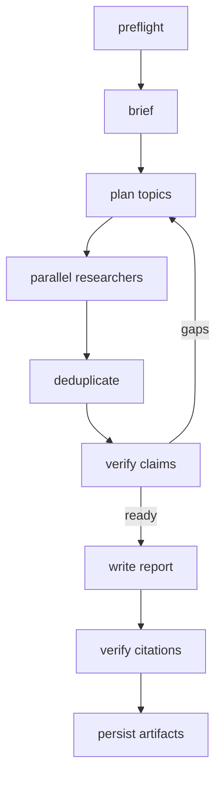
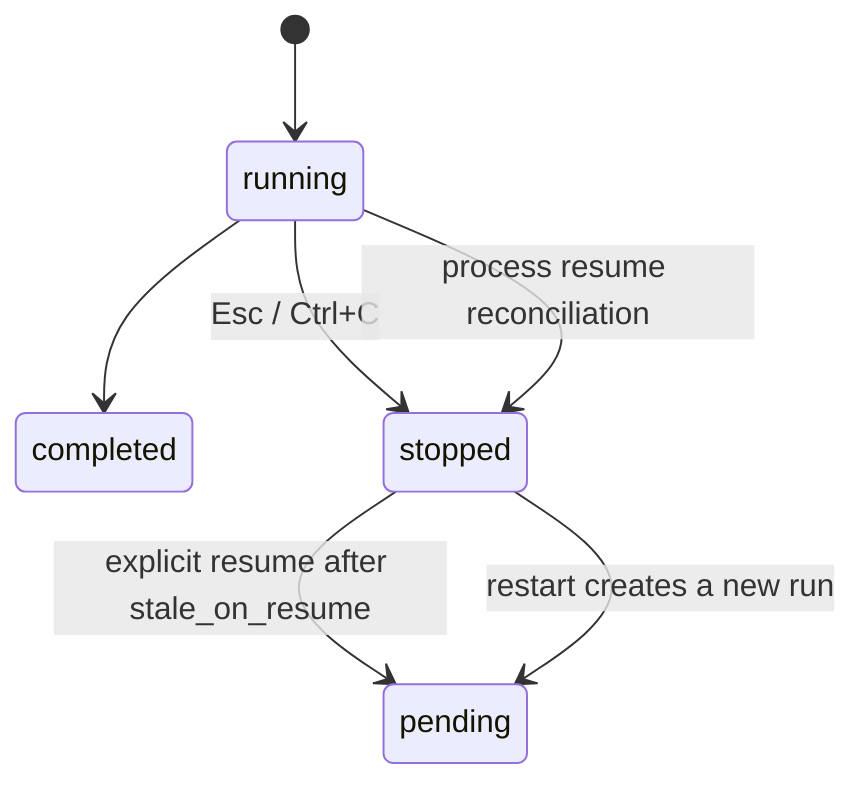

# Graph

> [简体中文](README.zh-CN.md)

`sdk/src/juice_agents/core/graph` is Juice's native state-graph and persisted runtime. A Graph is a controlled workflow script that an Agent can write, run, and debug. Agents use `graph_manage` to write scripts, `graph_view` to inspect them, and `graph_tool` to run them. Graph scripts orchestrate only; external actions must go through permission-controlled Agents or tools.

> [Chinese](README.zh-CN.md)

## Architecture



| Module | Responsibility |
| --- | --- |
| `state_graph.py` / `runtime.py` | `StateGraph`, supersteps, `Command`, `Send`, defer, and checkpoints |
| `core/managers/graphs.py` | `GraphRunManager`: instances, checkpoints, cancellation, results, and recovery |
| `runs.py` | `GraphRunStore`: persisted `.juice/runners/<runner_id>/graphs/` layout |
| `registry/graphs/registry.py` | Built-in/local discovery, local overrides, and AST safety checks |
| `builtins/deep_research.py` | The first built-in business Graph |
| `examples/graph/patterns/` | Eight independent native `StateGraph` topology examples |

## Single-file Graph

```python
from typing import TypedDict
from juice_agents.core.graph import END, StateGraph

GRAPH_METADATA = {
    "name": "counter",
    "description": "Increment a value.",
    "read_only": True,
    "input_schema": {"value": "integer"},
}

class State(TypedDict):
    value: int

def build_graph(context):
    graph = StateGraph(State)
    graph.add_node("increment", lambda state: {"value": state["value"] + 1})
    graph.set_entry_point("increment")
    graph.add_edge("increment", END)
    return graph.compile()
```

Workspace Graphs live at `.juice/graphs/<name>.py` and override a built-in with the same name. Local Graphs cannot access files, shells, networks, or dangerous imports directly; external actions must use permission-controlled Agents or tools.



## Deep Research

`deep_research` uses a native Juice Supervisor + Researcher Graph:



- Source modes: `web`, `workspace`, and `web_workspace`.
- The input field is `source_mode`; the legacy `source` field and unknown modes fail directly instead of silently degrading.
- The brief classifies questions as `simple`, `multi_part`, or `broad`. Simple questions start one researcher; other types run bounded parallel research.
- A claim is verified by one authoritative source or two independent, non-conflicting sources.
- Disputed or unverified claims appear only in limitations, never as report facts.
- A researcher must open or read a source before citing it; search snippets are leads, not evidence.
- Artifacts are `report.md`, `sources.json`, `claims.json`, and `debug.json`.
- Brief, supervisor, researcher, and writer call the Runner-owned `AgentManager` through `GraphBuildContext.agent_dispatcher.invoke_agent()`; they do not receive or create child Runners.

The architecture is informed by [Open Deep Research](https://github.com/langchain-ai/open_deep_research), its [main Graph](https://github.com/langchain-ai/open_deep_research/blob/main/src/open_deep_research/deep_researcher.py), and [Claude Code Dynamic workflows](https://code.claude.com/docs/zh-CN/workflows). The implementation is rewritten with Juice APIs and does not copy the LangGraph implementation or the original prompts.

## Run and control

```text
/deep-research <question>
/deep-research --workspace <question>
/deep-research --web-workspace <question>
/deep-research {"question":"...","source_mode":"web_workspace"}
/graph list
/graph view <name>
/graph run <name> [json]
/graph runs
/graph pause|resume|stop|restart <run_id>
```

`/deep-research` forwards to the root Agent when automatic Graph capability is enabled; otherwise it suggests `$graph:deep_research <question>`. `$graph:<name>` injects metadata and exposes a name-restricted `graph_tool` only in the current root stream. `/graph run` is always the direct development and debugging entry point. Foreground Graphs emit `runner_lifecycle` to the Runner stream; the CLI shows brief, planning, research `x/y`, verify, and report status without writing child-Agent reasoning or page bodies to the main transcript.



Pure-computation Graphs can run without a Runner, but a node that calls a real Agent must immediately report that the Runner is missing. Save a checkpoint after every superstep. On cancellation, concurrent workers perform bounded cleanup before the GraphRun returns `stopped`. Process recovery preserves checkpoints, reconciles stale managed Agents, and never resumes network execution automatically.

```text
.juice/runners/<runner_id>/graphs/<graph_run_id>/
├── manifest.json
├── source.py
├── events.jsonl
├── checkpoint.json
├── result.json
└── artifacts/
    ├── report.md
    ├── sources.json
    ├── claims.json
    └── debug.json
```

## Development conventions

- Graph files belong in workspace `.juice/graphs/*.py` or built-in `graph/builtins/`. Local scripts cannot access shells, files, or networks directly; external actions go through permission-controlled Agents or tools.
- `GraphRunManager` exclusively owns execution, source snapshots, checkpoints, events, results, and artifacts. Graphs call Runner-managed Agents through `GraphBuildContext.agent_dispatcher` and never receive or create child Runners.
- Root can manage Graphs; ordinary child Agents can inspect and run them by default. Reject `graph_manage` when `self_evolution.enabled=false`. `graphs.enabled=false` disables automatic Agent Graph tools but keeps `/graph` debugging commands.
- Foreground runs inherit the Runner cancellation signal; background Graphs are independent. Check cancellation, pause, and timeout during each concurrent superstep and wait only for bounded cleanup. Reconcile stale `pending/running` runs as `stopped(stale_on_resume)`; only that state and `paused` can resume, while a user-stopped run can only restart.
- Deep Research accepts `source_mode` only. Snippets are not evidence; only `verified_claims` enter report prose. Put tests in `tests/core/graph/` and the corresponding Graph-tool test directories.
