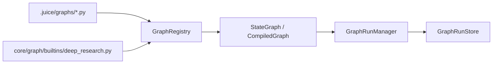
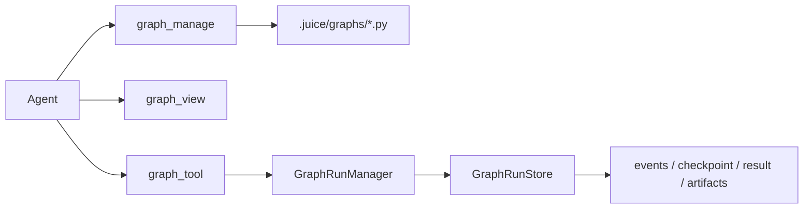
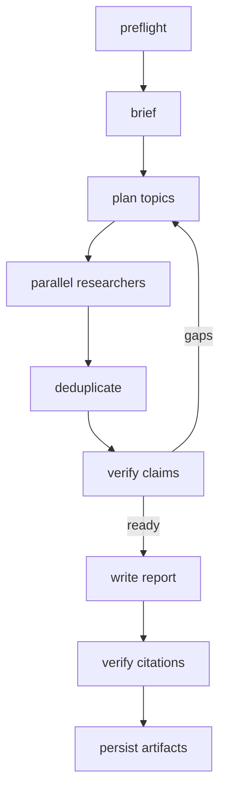
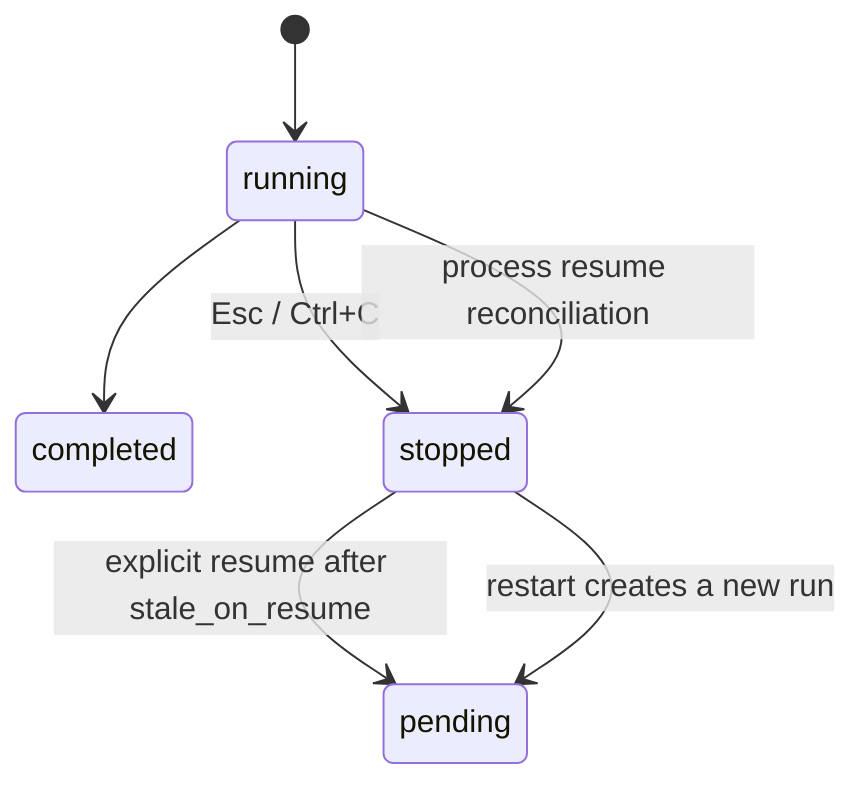

# Graph

`sdk/src/juice_agents/core/graph` 是 Juice 原生状态图与持久化运行时。Graph 的定位是 agent 可编写、可运行、可调试的受控流程脚本；Agent 通过 `graph_manage` 写脚本、`graph_view` 查脚本、`graph_tool` 调脚本。Graph 脚本只负责编排，外部动作必须通过受权限控制的 Agent/Tool 完成。

## 架构



| 模块 | 职责 |
| --- | --- |
| `state_graph.py` / `runtime.py` | `StateGraph`、superstep、`Command`、`Send`、defer、checkpoint |
| `core/managers/graphs.py` | `GraphRunManager`：实例、checkpoint、取消、结果与恢复 |
| `runs.py` | `GraphRunStore`：`.juice/runners/<runner_id>/graphs/` 持久化布局 |
| `registry/graphs/registry.py` | builtin/local 发现、local 覆盖、AST 安全校验 |
| `builtins/deep_research.py` | 首个 builtin 业务 graph |
| `examples/graph/patterns/` | 8 个独立原生 `StateGraph` 拓扑示例 |

## 单文件 Graph

```python
from typing import TypedDict
from juice_agents.core.graph import END, StateGraph

GRAPH_METADATA = {
    "name": "counter",
    "description": "Increment a value.",
    "read_only": True,
    "input_schema": {"value": "integer"},
}

class State(TypedDict):
    value: int

def build_graph(context):
    graph = StateGraph(State)
    graph.add_node("increment", lambda state: {"value": state["value"] + 1})
    graph.set_entry_point("increment")
    graph.add_edge("increment", END)
    return graph.compile()
```

Workspace graph 放在 `.juice/graphs/<name>.py`，同名时覆盖 builtin。Local graph 禁止直接文件、shell、网络和危险 import；外部动作必须通过受权限控制的 Agent/Tool。



## Deep Research

`deep_research` 使用 Juice 原生 Supervisor + Researcher 图：



- 来源模式：`web`、`workspace`、`web_workspace`
- 输入字段固定为 `source_mode`；传入旧 `source` 或未知模式会直接报错，不静默降级
- brief 将问题归类为 `simple`、`multi_part`、`broad`；简单问题只启动一个 researcher，其他类型按需并行且不超过配置上限
- verified：一个权威来源，或两个独立来源且无冲突
- disputed/unverified：只进入 limitations，不进入报告事实
- researcher 必须打开或读取来源后才能引用；搜索 snippet 只作为线索，不作为证据
- 产物：`report.md`、`sources.json`、`claims.json`、`debug.json`
- brief/supervisor/researcher/writer 都通过 `GraphBuildContext.agent_dispatcher.invoke_agent()` 请求 Runner-owned `AgentManager`，不接收或创建子 Runner

架构参考 [Open Deep Research](https://github.com/langchain-ai/open_deep_research)、[主 Graph](https://github.com/langchain-ai/open_deep_research/blob/main/src/open_deep_research/deep_researcher.py) 与 [Claude Code Dynamic workflows](https://code.claude.com/docs/zh-CN/workflows)。实现使用 Juice API 重写，不复制 LangGraph 实现或原项目提示词。

## 运行与控制

```text
/deep-research <question>
/deep-research --workspace <question>
/deep-research --web-workspace <question>
/deep-research {"question":"...","source_mode":"web_workspace"}
/graph list
/graph view <name>
/graph run <name> [json]
/graph runs
/graph pause|resume|stop|restart <run_id>
```

`/deep-research` 会在 Graph 自动能力开启时转发给 root agent；关闭时提示 `$graph:deep_research <问题>`。`$graph:<name>` 注入 metadata 并只在当前 root stream 公开名称受限的 `graph_tool`；`/graph run` 始终是开发调试直跑入口。前台 Graph 向 Runner stream 输出 `runner_lifecycle`，CLI 显示 brief、planning、research `x/y`、verify、report 等临时状态，不把子 Agent 思考或网页正文写入主 transcript。



纯计算 Graph 可在没有 Runner 时执行，但调用真实 Agent 的节点必须立即报告缺少 Runner。每个 superstep 后保存 checkpoint；取消时并发 worker 先执行有界清理，GraphRun 再以 `stopped` 返回。进程恢复会保留 checkpoint、收敛遗留 managed Agent，并且不会自动继续联网执行。

```text
.juice/runners/<runner_id>/graphs/<graph_run_id>/
├── manifest.json
├── source.py
├── events.jsonl
├── checkpoint.json
├── result.json
└── artifacts/
    ├── report.md
    ├── sources.json
    ├── claims.json
    └── debug.json
```

## 开发约束

- Graph 文件只放在 workspace `.juice/graphs/*.py` 或内置 `graph/builtins/`；本地脚本不直接访问 shell、文件和网络，外部动作交给受权限控制的 Agent/Tool。
- `GraphRunManager` 是执行与 source snapshot、checkpoint、events、result、artifacts 的唯一所有者。Graph 通过 `GraphBuildContext.agent_dispatcher` 调 Runner 管理的 Agent，不接收或创建子 Runner。
- root 可管理 Graph，普通子 Agent 默认只能查看和运行；`self_evolution.enabled=false` 时必须拒绝 `graph_manage`。`graphs.enabled=false` 关闭自动 Agent Graph 工具，但保留 `/graph` 调试入口。
- 前台运行继承 Runner 取消信号；后台 Graph 独立。并发 superstep 周期检查取消/暂停/超时，停止只等待有界清理。恢复时遗留 `pending/running` 收敛为 `stopped(stale_on_resume)`，仅该状态及 paused 可续跑；用户停止后只能重启。
- Deep Research 只接受 `source_mode`；snippet 不能直接作为证据，仅 `verified_claims` 进入报告正文。测试放 `tests/core/graph/` 和 Graph 工具对应目录。
