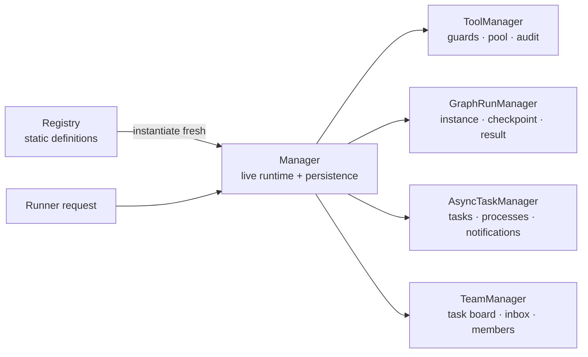

# Runtime Managers

`core/managers/` owns mutable runtime state. Registries only resolve and validate static definitions; Runner only routes requests to managers.

| Manager | Owns | Durable data | Recovery behavior |
| --- | --- | --- | --- |
| `ToolManager` | tool pool, bound permission/cancel context, call records | `tool_calls.jsonl` | restores audit identifiers only; never recreates a Tool from an audit record |
| `GraphRunManager` | live graph instance, run lock/future, cancel event | manifest, source snapshot, events, checkpoint, result | active runs become `stopped(stale_on_resume)`; an explicit resume builds fresh |
| `AsyncTaskManager` | task state, pool, subprocesses, notifications and task-output access | `registry.json`, task output files | active opaque callbacks become `killed(stale_on_recovery)`; notifications are replayed |
| `TeamManager` | Team tasks, dependencies, eligibility, claims, inboxes, members and finish gate | `team.json` | failed member work remains `in_progress` with an error for root review; saved message IDs can be reconciled and acknowledged |

Managers take explicit state paths and callback/event-sink injection. They do not import or retain a Runner instance, and no manager reads static YAML.

Team writes are serialized across Manager instances and atomically persisted before `on_change` emits a `team_update` payload. A claim checks eligibility, dependencies and task status under the same lock. A message stays pending until its ID is present in a saved receiving session step and `ack_messages` confirms delivery. Root must review a failed task before changing its status or eligible members; active member work cannot be reassigned or deleted.

Task output is read through `AsyncTaskManager.read_output(task_id)`. Transports
must not import the private task-store format or construct background processes
themselves.

## 开发约束

- Manager 用明确的状态路径与回调独立构造；可用私有执行辅助类，但状态和活实例仍由 Manager 持有。Registry 管静态声明，Runner 只调度请求。
- 终态先持久化，再通知观察者。取消采用协作式 token 和已知子进程终止，不强杀 Python 线程；恢复时无法重启任意回调，遗留活跃任务收敛到可见终态并重放持久通知。
- Team 领取、依赖和收件箱写入需在同一文件锁下校验并原子替换；收到消息的 session step 保存后才确认消息 ID。失败任务保留 `in_progress` 及错误供 root 审核，活跃成员任务不可改派或删除。
- 网关通过 `AsyncTaskManager.read_output()` 读取任务输出，由该 Manager 创建 shell 工作。测试放在 `tests/core/managers/`，覆盖正常、失败/取消、恢复和释放。
