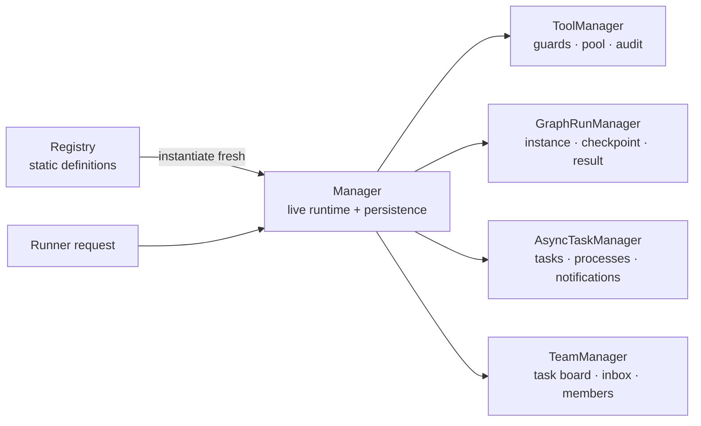

# Runtime Managers

> [简体中文](README.zh-CN.md)

`core/managers/` owns mutable runtime state. Registries only resolve and validate static definitions; Runner only routes requests to managers.

| Manager | Owns | Durable data | Recovery behavior |
| --- | --- | --- | --- |
| `ToolManager` | tool pool, bound permission/cancel context, call records | `tool_calls.jsonl` | restores audit identifiers only; never recreates a Tool from an audit record |
| `GraphRunManager` | live graph instance, run lock/future, cancel event | manifest, source snapshot, events, checkpoint, result | active runs become `stopped(stale_on_resume)`; an explicit resume builds fresh |
| `AsyncTaskManager` | task state, pool, subprocesses, notifications and task-output access | `registry.json`, task output files | active opaque callbacks become `killed(stale_on_recovery)`; notifications are replayed |
| `TeamManager` | Team tasks, dependencies, eligibility, claims, inboxes, members and finish gate | `team.json` | failed member work remains `in_progress` with an error for root review; saved message IDs can be reconciled and acknowledged |

Managers take explicit state paths and callback/event-sink injection. They do not import or retain a Runner instance, and no manager reads static YAML.

Team writes are serialized across Manager instances and atomically persisted before `on_change` emits a `team_update` payload. A claim checks eligibility, dependencies and task status under the same lock. A message stays pending until its ID is present in a saved receiving session step and `ack_messages` confirms delivery. Root must review a failed task before changing its status or eligible members; active member work cannot be reassigned or deleted.

Task output is read through `AsyncTaskManager.read_output(task_id)`. Transports
must not import the private task-store format or construct background processes
themselves.

## Development conventions

- Construct Managers independently with explicit state paths and callbacks. Private execution helpers are fine, but the Manager owns state and live instances. Registry owns static declarations; Runner only schedules requests.
- Persist terminal state before notifying observers. Cancellation uses cooperative tokens and termination of known child processes rather than killing Python threads. Recovery cannot restart arbitrary callbacks; stale active tasks converge to visible terminal states and persisted notifications are replayed.
- Validate Team claims, dependencies, and inbox writes under one file lock and replace state atomically. Confirm a message ID only after its receiving session step is saved. Leave failed tasks `in_progress` with an error for root review; active member tasks cannot be reassigned or deleted.
- Gateways read task output through `AsyncTaskManager.read_output()`, and that Manager creates shell work. Put tests in `tests/core/managers/` covering success, failure/cancellation, recovery, and release.
