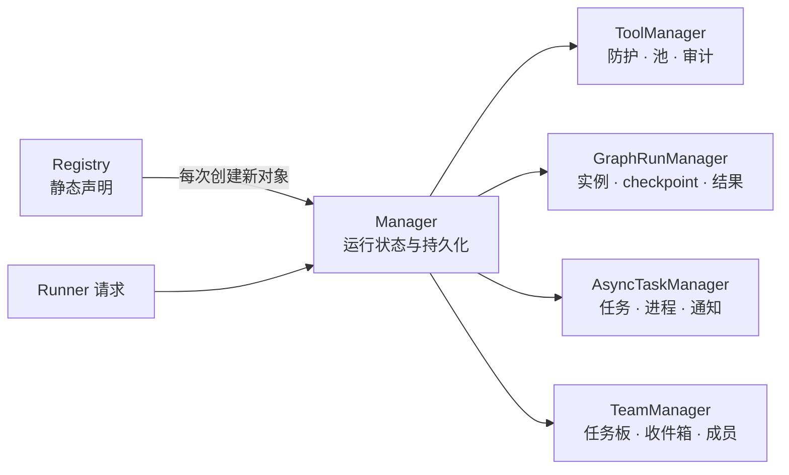

> [English](README.md)

# 运行时 Managers

`core/managers/` 持有可变运行状态。Registry 只解析和校验静态声明，Runner 只把请求分发给 Managers。

| Manager | 所有权 | 持久数据 | 恢复行为 |
| --- | --- | --- | --- |
| `ToolManager` | 工具池、绑定的权限/取消上下文、调用记录 | `tool_calls.jsonl` | 只恢复审计标识；不会从审计记录重建 Tool |
| `GraphRunManager` | live graph、运行锁/future、取消事件 | manifest、源码快照、events、checkpoint、result | 活跃运行收敛为 `stopped(stale_on_resume)`；显式恢复时重新构造 |
| `AsyncTaskManager` | 任务状态、线程池、子进程、通知及输出读取 | `registry.json`、任务输出文件 | 不透明的活跃回调变为 `killed(stale_on_recovery)`；重放通知 |
| `TeamManager` | Team 任务、依赖、资格、领取、收件箱、成员及完成门控 | `team.json` | 失败成员任务保留 `in_progress` 和错误供 root 审核；可对账并确认已保存的消息 ID |

Manager 通过明确的状态路径及回调/event sink 注入进行构造。它们不导入或持有 Runner 实例，也不读取静态 YAML。

多个 TeamManager 实例之间的写入会串行化，并在 `on_change` 发出 `team_update` 前原子持久化。领取任务时，在同一把锁下检查资格、依赖和状态。消息 ID 只有在接收方 session step 已保存且 `ack_messages` 确认后才会清除待投递状态。root 必须先审核失败任务，才能修改其状态或可执行成员；运行中的成员任务不可改派或删除。

任务输出通过 `AsyncTaskManager.read_output(task_id)` 读取。传输层不能导入私有任务存储格式，也不能自行创建后台进程。

## 开发约定

- 使用显式状态路径和回调独立构造 Manager。可以使用私有执行辅助类，但状态和 live 实例仍归 Manager 所有。Registry 管静态声明，Runner 负责调度请求。
- 先持久化终态，再通知观察者。取消使用协作式 token 并终止已知子进程，不强杀 Python 线程。恢复时无法重启任意回调；遗留活跃任务需收敛到可见终态，并重放持久通知。
- Team 领取、依赖和收件箱写入需在同一文件锁下校验并原子替换。接收方 session step 保存后才确认消息 ID。失败任务保留 `in_progress` 及错误供 root 审核，活跃成员任务不可改派或删除。
- 网关通过 `AsyncTaskManager.read_output()` 读取任务输出，由该 Manager 创建 shell 工作。测试放在 `tests/core/managers/`，覆盖成功、失败/取消、恢复和释放。
